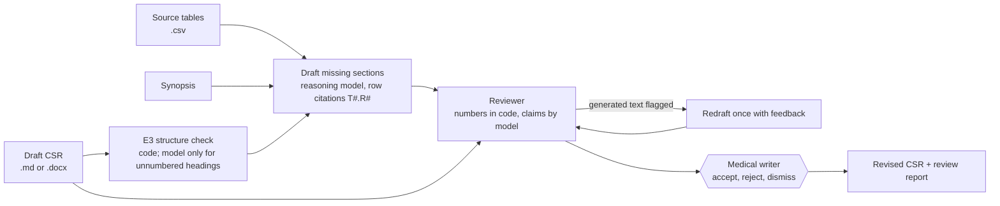

# csr-assistant

**An assistant for clinical study reports (ICH E3) that never lets the model do arithmetic.** It takes a draft
CSR, the study's source tables and the protocol synopsis, and:

1. checks the draft against the **ICH E3** structure: which required sections are missing, empty or out of order;
2. **drafts missing sections from the source tables only**, citing a table row for every sentence with data,
   and marks sections it cannot draft (for example informed consent) with exactly what information is missing;
3. runs a **reviewer** over both the writer's text and the generated text: every number must trace to the
   sources (checked in code), and qualitative claims ("superior", "well tolerated", "no safety signal") are
   checked against the data, with a neutral rewrite suggested;
4. pauses for the **medical writer**, who accepts or rejects each drafted section and dismisses findings, then
   writes the revised CSR (Markdown or Word) and a review report.



## Why

Clinical study reports run to hundreds of pages, follow ICH E3, and every number must match the statistical
outputs exactly. Two problems come up again and again in medical writing and regulatory review: numbers that
do not match the tables, and conclusions that go beyond the data. This tool targets exactly those two, and
keeps a human accountable for every word.

## Design decisions

- **Numbers are verified by code.** In generated text, every number must appear in the rows it cites, at the
  precision written, or be n / N of two whole counts in one cited row. In the writer's text (no citations),
  numbers are matched first against the table the sentence is about (by terms such as "nausea" or "HbA1c"),
  then against all sources; a number found only in another table is a medium finding ("right number, wrong
  endpoint?"). Whole counts must match exactly, percentages may be rounded, and "increased" never matches a
  negative change. No model judgement on numbers.
- **The model never drafts what the data cannot support.** Sections without source tables get a placeholder
  listing the missing information, not invented text.
- **Two roles.** A drafter writes; a reviewer, prompted to be sceptical, checks. Generated text that fails
  review is redrafted once with the reviewer's feedback.
- **Human accountability.** Every drafted section carries a DRAFT banner and stays pending until the writer
  accepts it; dismissed findings stay visible in the report.
- **Audit trail.** Row citations make every generated number traceable to a source table.

## Quick start

No GPU needed. Python 3.11 to 3.13.

```bash
python -m venv .venv && source .venv/bin/activate
pip install -e ".[dev,docx,pdf]"
cp .env.example .env                  # API key for an OpenAI-compatible endpoint
csr structure src/csr_assistant/samples/study_syn301/draft_csr.md      # E3 check only, no model
csr demo                              # synthetic study SYN-301-03, end to end
csr eval                              # scores on the planted problems
pytest                                # offline tests with scripted model responses
```

Your own study:

```bash
csr review draft_csr.docx tables/ --synopsis synopsis.md --docx
```

Source tables are CSV files, one per table; an optional first line `# title: Table 14.3.1 ...` names it. Each
row gets an id (`T6.R1` = table 6, row 1) that the drafted text cites. Outputs in `runs/latest/`:
`revised_csr.md` (and `.docx`), `review_report.md`, `findings.json`, `drafted_sections.json`,
`structure.json`.

## Test study with known answers

`src/csr_assistant/samples/study_syn301/` is a fictional phase 3 study (SYN-301-03: the made-up GLP-1
receptor agonist SYN-301 versus placebo, 240 patients) with seven source tables and a draft CSR containing planted problems:

| Planted problem | Section | Expected behaviour |
| --- | --- | --- |
| Sections 5.3, 10.1, 12.1 missing; 12.2 empty | structure | Detect; draft 10.1, 12.1 and 12.2.1 from tables; placeholder for 5.3 |
| "HbA1c decreased by 1.4%" (table: -1.21) | 11.4.1 | Number finding |
| "superior to all approved GLP-1 receptor agonists" | 11.4.1 | Unsupported claim (no active comparator) |
| "well tolerated, with no gastrointestinal safety signal" (nausea 18.5% vs 5.0%) | 12.6 | Overstated claim |
| "lowered body weight by 4.5 kg" (table: -3.1) | 13 | Number finding |

`expected.json` lists these plus six correct claims that must not be flagged. `csr eval` reports structure
precision and recall, planted-error recall, false alarms on correct claims, and how many generated sentences
pass review.

## Real documents: EMA assessment reports

European Public Assessment Reports (EPARs) are public, long, and full of efficacy and safety narrative with
tables, which makes them good material to stress-test the reviewer. They are the regulator's assessment, not
CSRs, so use them for claim checking rather than structure checking.

```bash
# download an EPAR PDF from https://www.ema.europa.eu/en/medicines (medicine page -> assessment report)
csr epar epar.pdf --pages 45-60            # extracts the narrative and tables of the clinical chapters
csr review runs/epar_package/draft_csr.md runs/epar_package/tables --no-review --review-only
```

PDF table extraction is imperfect; check the CSVs.

## NeMo Agent Toolkit

```bash
pip install -e ".[nat]"
nat run --config_file configs/workflow.yml --input "src/csr_assistant/samples/study_syn301/draft_csr.md | src/csr_assistant/samples/study_syn301/tables | src/csr_assistant/samples/study_syn301/synopsis.md"
nat mcp serve --config_file configs/workflow.yml
```

## Configuration

Settings come from environment variables or `.env` (see `.env.example`): `NIM_BASE_URL` (any
OpenAI-compatible endpoint, hosted or self-hosted), `NVIDIA_API_KEY`, `CSR_MODEL_REASONING`,
`CSR_MODEL_FAST`, `CSR_THINKING`, `CSR_TEMPERATURE`, `CSR_MAX_TOKENS`. `csr models` lists the model IDs your endpoint serves.

## Project layout

```
src/csr_assistant/
  e3.py              ICH E3 section model (numbers, titles, aliases, required sections)
  structure.py       structure check: missing, empty and out-of-order sections
  sources.py         source tables with row ids, synopsis
  drafter.py         table-grounded drafting with row citations
  numcheck.py        deterministic number verification
  reviewer.py        number findings plus claim review by the model
  agent.py           LangGraph workflow with the medical-writer review step
  export.py, epar.py Word export; EPAR PDF extraction
  evaluate.py        scores on the planted problems
  llm.py, config.py  OpenAI-compatible client with guided JSON; settings
  nat_plugin/        NeMo Agent Toolkit component
  samples/           synthetic study SYN-301-03
tests/               offline tests
```

## Development

```bash
pip install -e ".[dev]"
ruff check . && ruff format --check .
pytest
```

## Limitations

- A research prototype with synthetic data; not validated for regulatory use.
- Covers the E3 sections most often drafted from tables (disposition, demographics, efficacy, exposure,
  adverse events); laboratory and vital-sign sections need their own tables.
- A correct number from the right table but the wrong treatment group can still pass the number check.
- Consistency across sections (for example N in the text versus N in the tables) is not yet checked.

## Licence

Apache-2.0 (see `LICENSE`). The sample study is fictional.
